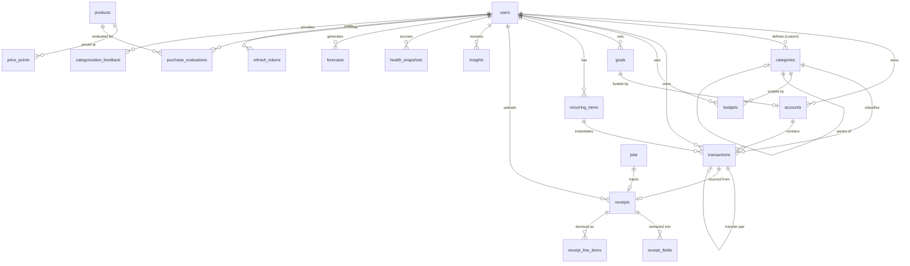

# Frugal — Data Model

**Version:** 1.0 · **Database:** PostgreSQL 16 (Neon) · **Last updated:** 2026-08-04
**Companion documents:** [SRS](01-srs.md) · [Architecture](02-architecture.md) · [API design](04-api-design.md)

---

## 1. Modelling conventions

These apply to every table without exception. They are stated once here rather than repeated per table.

| Convention | Rule | Rationale |
|---|---|---|
| **Primary keys** | `UUID` v7, generated application-side | Time-sortable like a sequence, but non-enumerable in URLs. Sequential integer IDs leak volume and invite enumeration. |
| **Money** | `NUMERIC(18,2)` + a `currency CHAR(3)` column beside it | Float money is a correctness defect. Currency stored from day one because retrofitting it is a data migration across every financial table. |
| **Timestamps** | `TIMESTAMPTZ`, always UTC | Conversion happens at the presentation boundary only. `TIMESTAMP` without zone is how DST bugs enter. |
| **Dates** | `DATE` for user-facing financial dates (`occurred_on`) | A transaction happens on a calendar day in the user's locale, not at an instant. Storing it as a timestamp creates off-by-one-day bugs at midnight boundaries. |
| **Audit columns** | `created_at`, `updated_at` on every table | |
| **Soft delete** | `deleted_at TIMESTAMPTZ NULL` on user-owned tables; partial indexes exclude deleted rows | 30-day restore (FR-2.11) without losing referential integrity. |
| **Tenancy** | Every user-owned table carries `user_id` **directly**, even when reachable via a parent | Denormalised deliberately: it lets `BaseRepository` scope every query with one predicate, and makes an unscoped query structurally impossible rather than merely discouraged. |
| **Enums** | Postgres native `ENUM` types | Constraint enforced by the database, not only the application. |
| **Naming** | `snake_case`, plural tables, `fk_`/`ix_`/`uq_`/`ck_` prefixes | |

---

## 2. Entity-relationship overview



Product and price tables exist in v1 only as the seeded catalogue backing the advisor (FR-8.2); the
wishlist and alerting layer arrives in M9.

---

## 3. Core tables

### 3.1 `users`

| Column | Type | Constraints |
|---|---|---|
| `id` | UUID | PK |
| `email` | CITEXT | NOT NULL, UNIQUE |
| `password_hash` | TEXT | NULL — null for OAuth-only accounts |
| `display_name` | VARCHAR(120) | NOT NULL |
| `base_currency` | CHAR(3) | NOT NULL, DEFAULT `'INR'` |
| `timezone` | VARCHAR(64) | NOT NULL, DEFAULT `'Asia/Kolkata'` |
| `locale` | VARCHAR(16) | NOT NULL, DEFAULT `'en-IN'` |
| `email_verified_at` | TIMESTAMPTZ | NULL |
| `oauth_provider` | ENUM(`google`) | NULL |
| `oauth_subject` | TEXT | NULL |
| `is_demo_seeded` | BOOLEAN | NOT NULL, DEFAULT false |
| `created_at` / `updated_at` / `deleted_at` | TIMESTAMPTZ | |

```
UNIQUE uq_users_email                 (email) WHERE deleted_at IS NULL
UNIQUE uq_users_oauth                 (oauth_provider, oauth_subject)
CHECK  ck_users_auth_method           password_hash IS NOT NULL OR oauth_subject IS NOT NULL
```

`CITEXT` makes email comparison case-insensitive at the database level — the alternative (lowercasing
in application code) fails the moment any code path forgets.

### 3.2 `refresh_tokens`

Supports rotation with reuse detection (FR-1.3).

| Column | Type | Constraints |
|---|---|---|
| `id` | UUID | PK |
| `user_id` | UUID | FK → users, NOT NULL, ON DELETE CASCADE |
| `family_id` | UUID | NOT NULL — shared across a rotation chain |
| `token_hash` | TEXT | NOT NULL, UNIQUE — SHA-256; raw token never stored |
| `expires_at` | TIMESTAMPTZ | NOT NULL |
| `used_at` | TIMESTAMPTZ | NULL |
| `revoked_at` | TIMESTAMPTZ | NULL |
| `user_agent` / `ip_address` | TEXT / INET | NULL |

```
INDEX ix_refresh_tokens_family        (family_id)
INDEX ix_refresh_tokens_user_active   (user_id) WHERE revoked_at IS NULL
```

**Reuse detection:** presenting a token whose `used_at` is already set means the token was stolen and
replayed. The response is to revoke every row sharing its `family_id`, logging the user out everywhere.
Storing only the hash means a database leak yields no usable tokens.

### 3.3 `accounts`

| Column | Type | Constraints |
|---|---|---|
| `id` | UUID | PK |
| `user_id` | UUID | FK → users, NOT NULL |
| `name` | VARCHAR(120) | NOT NULL |
| `type` | ENUM(`bank`,`cash`,`credit_card`,`wallet`,`loan`,`investment`) | NOT NULL |
| `currency` | CHAR(3) | NOT NULL |
| `opening_balance` | NUMERIC(18,2) | NOT NULL, DEFAULT 0 |
| `current_balance` | NUMERIC(18,2) | NOT NULL, DEFAULT 0 — materialised |
| `credit_limit` | NUMERIC(18,2) | NULL — credit cards only |
| `is_liquid` | BOOLEAN | NOT NULL, DEFAULT true |
| `institution` | VARCHAR(120) | NULL |
| `archived_at` | TIMESTAMPTZ | NULL |

```
INDEX  ix_accounts_user               (user_id) WHERE deleted_at IS NULL
UNIQUE uq_accounts_user_name          (user_id, name) WHERE deleted_at IS NULL
CHECK  ck_accounts_credit_limit       type <> 'credit_card' OR credit_limit IS NOT NULL
```

**`is_liquid` carries real weight** — it is what the advisor and emergency-fund metric use to
distinguish spendable savings from a locked deposit or an investment account. Getting this wrong
inflates affordability.

**`current_balance` is materialised**, updated transactionally on every transaction write. Recomputing
from the full ledger on each dashboard load is O(n) per request; a nightly reconciliation job verifies
the materialised value against the ledger sum and logs drift.

### 3.4 `categories`

| Column | Type | Constraints |
|---|---|---|
| `id` | UUID | PK |
| `user_id` | UUID | FK → users, **NULL for system categories** |
| `parent_id` | UUID | FK → categories, NULL |
| `name` | VARCHAR(80) | NOT NULL |
| `slug` | VARCHAR(80) | NOT NULL |
| `kind` | ENUM(`income`,`expense`,`transfer`) | NOT NULL |
| `icon` / `color` | VARCHAR(40) / CHAR(7) | NULL |
| `is_system` | BOOLEAN | NOT NULL, DEFAULT false |
| `sort_order` | SMALLINT | NOT NULL, DEFAULT 0 |

```
UNIQUE uq_categories_user_slug        (COALESCE(user_id, '00000000-...'::uuid), slug)
INDEX  ix_categories_user             (user_id)
CHECK  ck_categories_depth            parent_id IS NULL OR parent_id <> id
```

Two levels only. Deeper hierarchies make budget rollup ambiguous and analytics queries recursive for no
user-visible gain. `user_id IS NULL` marks the shared system taxonomy, which is also the label space
the categoriser (FR-5.3) is trained against.

### 3.5 `transactions`

The busiest table in the system; every index here is chosen against a specific query.

| Column | Type | Constraints |
|---|---|---|
| `id` | UUID | PK |
| `user_id` | UUID | FK → users, NOT NULL |
| `account_id` | UUID | FK → accounts, NOT NULL |
| `category_id` | UUID | FK → categories, NULL — null means uncategorised |
| `kind` | ENUM(`income`,`expense`,`transfer`) | NOT NULL |
| `amount` | NUMERIC(18,2) | NOT NULL, CHECK > 0 — sign is carried by `kind` |
| `currency` | CHAR(3) | NOT NULL |
| `occurred_on` | DATE | NOT NULL |
| `merchant_raw` | VARCHAR(255) | NULL — as received |
| `merchant_normalized` | VARCHAR(255) | NULL — cleaned (FR-5.1) |
| `description` | TEXT | NULL |
| `transfer_pair_id` | UUID | FK → transactions, NULL |
| `receipt_id` | UUID | FK → receipts, NULL |
| `recurring_item_id` | UUID | FK → recurring_items, NULL |
| `source` | ENUM(`manual`,`csv_import`,`receipt`,`recurring`,`demo_seed`) | NOT NULL |
| `content_hash` | CHAR(64) | NOT NULL — SHA-256 |
| `category_confidence` | NUMERIC(4,3) | NULL |
| `categorizer_version` | VARCHAR(32) | NULL |
| `is_reviewed` | BOOLEAN | NOT NULL, DEFAULT false |
| `excluded_from_analytics` | BOOLEAN | NOT NULL, DEFAULT false |

```
UNIQUE uq_transactions_content_hash   (user_id, content_hash) WHERE deleted_at IS NULL
INDEX  ix_transactions_user_date      (user_id, occurred_on DESC) WHERE deleted_at IS NULL
INDEX  ix_transactions_user_cat_date  (user_id, category_id, occurred_on DESC) WHERE deleted_at IS NULL
INDEX  ix_transactions_user_acct_date (user_id, account_id, occurred_on DESC) WHERE deleted_at IS NULL
INDEX  ix_transactions_merchant_trgm  USING gin (merchant_normalized gin_trgm_ops)
INDEX  ix_transactions_uncategorized  (user_id, occurred_on DESC)
         WHERE category_id IS NULL AND deleted_at IS NULL
CHECK  ck_transactions_amount_positive amount > 0
CHECK  ck_transactions_transfer_pair   kind <> 'transfer' OR transfer_pair_id IS NOT NULL
```

**Index rationale:**

- `uq_transactions_content_hash` is the mechanism behind idempotent import (FR-2.6). Hash =
  `SHA256(user_id | occurred_on | amount | normalized_merchant | account_id)`. Re-importing a CSV
  conflicts and is skipped. Enforced by the database, so no import path can bypass it.
- `ix_transactions_user_date` serves the dominant access pattern — a user's ledger in date order.
- The category and account variants serve drill-down (FR-3.2) without falling back to a filtered scan.
- The trigram GIN index supports fuzzy merchant search and the merchant-similarity lookup the
  categoriser uses for its rules layer.
- `ix_transactions_uncategorized` is a small partial index serving the review queue directly; without
  the `WHERE`, it would duplicate the full table for a query that touches a handful of rows.

**Why `amount` is always positive with sign in `kind`:** signed amounts invite double-negation bugs
(`SUM(amount) WHERE kind='expense'` returning a negative that some call sites re-negate). An explicit
discriminator makes every aggregate read unambiguously.

### 3.6 `budgets`

| Column | Type | Constraints |
|---|---|---|
| `id` | UUID | PK |
| `user_id` | UUID | FK → users, NOT NULL |
| `category_id` | UUID | FK → categories, NULL — null = overall budget |
| `period` | ENUM(`monthly`) | NOT NULL |
| `period_start` | DATE | NOT NULL |
| `amount_limit` | NUMERIC(18,2) | NOT NULL, CHECK > 0 |
| `currency` | CHAR(3) | NOT NULL |
| `rollover_enabled` | BOOLEAN | NOT NULL, DEFAULT false |
| `rollover_amount` | NUMERIC(18,2) | NOT NULL, DEFAULT 0 |

```
UNIQUE uq_budgets_user_cat_period     (user_id, COALESCE(category_id,'000...'::uuid), period_start)
                                        WHERE deleted_at IS NULL
INDEX  ix_budgets_user_period         (user_id, period_start DESC)
```

Budgets are **per period instance**, not templates. A row per month means historical budgets stay
immutable — changing October's limit must not retroactively alter March's "over budget" insight, which
a single mutable template row would do.

### 3.7 `goals`

| Column | Type | Constraints |
|---|---|---|
| `id` | UUID | PK |
| `user_id` | UUID | FK → users, NOT NULL |
| `name` | VARCHAR(120) | NOT NULL |
| `target_amount` | NUMERIC(18,2) | NOT NULL, CHECK > 0 |
| `current_amount` | NUMERIC(18,2) | NOT NULL, DEFAULT 0 |
| `currency` | CHAR(3) | NOT NULL |
| `target_date` | DATE | NULL |
| `linked_account_id` | UUID | FK → accounts, NULL |
| `priority` | SMALLINT | NOT NULL, DEFAULT 3 — 1 highest |
| `status` | ENUM(`active`,`achieved`,`paused`,`abandoned`) | NOT NULL, DEFAULT `active` |

```
INDEX ix_goals_user_status            (user_id, status) WHERE deleted_at IS NULL
```

`priority` is consumed by the advisor's opportunity-cost calculation (FR-8.10): delaying a priority-1
goal is weighted more heavily than delaying a priority-3 one.

### 3.8 `recurring_items`

Feeds forecasting tier 1 (FR-7.4) and bill reminders (M10).

| Column | Type | Constraints |
|---|---|---|
| `id` | UUID | PK |
| `user_id` | UUID | FK → users, NOT NULL |
| `account_id` | UUID | FK → accounts, NULL |
| `category_id` | UUID | FK → categories, NULL |
| `name` | VARCHAR(120) | NOT NULL |
| `kind` | ENUM(`income`,`expense`) | NOT NULL |
| `item_type` | ENUM(`salary`,`rent`,`emi`,`subscription`,`utility`,`other`) | NOT NULL |
| `amount` | NUMERIC(18,2) | NOT NULL |
| `currency` | CHAR(3) | NOT NULL |
| `cadence` | ENUM(`weekly`,`fortnightly`,`monthly`,`quarterly`,`yearly`) | NOT NULL |
| `next_due_on` | DATE | NOT NULL |
| `end_on` | DATE | NULL |
| `amount_variance` | NUMERIC(5,4) | NULL — observed coefficient of variation |
| `detection_confidence` | NUMERIC(4,3) | NULL — null when user-created |
| `is_auto_detected` | BOOLEAN | NOT NULL, DEFAULT false |
| `is_active` | BOOLEAN | NOT NULL, DEFAULT true |

```
INDEX ix_recurring_user_due           (user_id, next_due_on) WHERE is_active AND deleted_at IS NULL
INDEX ix_recurring_user_type          (user_id, item_type)
```

`amount_variance` distinguishes a fixed EMI (variance ≈ 0, forecastable exactly) from a utility bill
(variance ≈ 0.3, forecastable as a distribution). The forecaster uses it to widen or tighten confidence
intervals per item instead of applying one blanket assumption.

---

## 4. Receipt tables

### 4.1 `receipts`

| Column | Type | Constraints |
|---|---|---|
| `id` | UUID | PK |
| `user_id` | UUID | FK → users, NOT NULL |
| `s3_key` | TEXT | NOT NULL — object key only, never a URL |
| `content_type` | VARCHAR(64) | NOT NULL |
| `file_size_bytes` | INTEGER | NOT NULL, CHECK ≤ 10485760 |
| `status` | ENUM(`pending_upload`,`queued`,`processing`,`needs_review`,`ready`,`committed`,`failed`) | NOT NULL |
| `merchant_extracted` | VARCHAR(255) | NULL |
| `total_extracted` | NUMERIC(18,2) | NULL |
| `date_extracted` | DATE | NULL |
| `tax_extracted` | NUMERIC(18,2) | NULL |
| `overall_confidence` | NUMERIC(4,3) | NULL |
| `ocr_engine_version` | VARCHAR(32) | NULL |
| `processing_ms` | INTEGER | NULL |
| `error_message` | TEXT | NULL |
| `committed_transaction_id` | UUID | FK → transactions, NULL |

```
INDEX ix_receipts_user_status         (user_id, status) WHERE deleted_at IS NULL
INDEX ix_receipts_user_created        (user_id, created_at DESC)
```

Storing `s3_key` rather than a URL is deliberate: presigned URLs expire, so a stored URL is a stored
expiry bug. The URL is generated on read.

### 4.2 `receipt_fields`

The table that makes per-field human-in-the-loop review (FR-4.3, FR-4.4) possible.

| Column | Type | Constraints |
|---|---|---|
| `id` | UUID | PK |
| `receipt_id` | UUID | FK → receipts, NOT NULL, ON DELETE CASCADE |
| `user_id` | UUID | FK → users, NOT NULL |
| `field_name` | ENUM(`merchant`,`date`,`total`,`tax`,`subtotal`,`payment_method`) | NOT NULL |
| `raw_text` | TEXT | NULL — exactly what OCR read |
| `parsed_value` | TEXT | NULL — normalised |
| `confidence` | NUMERIC(4,3) | NOT NULL |
| `bbox` | JSONB | NULL — `{x,y,w,h}` for image highlighting |
| `needs_review` | BOOLEAN | NOT NULL |
| `corrected_value` | TEXT | NULL |
| `corrected_at` | TIMESTAMPTZ | NULL |

```
UNIQUE uq_receipt_fields              (receipt_id, field_name)
INDEX  ix_receipt_fields_review       (user_id) WHERE needs_review AND corrected_at IS NULL
```

Keeping `raw_text` alongside `parsed_value` is what makes OCR failures debuggable — when a total parses
wrong, the raw token shows whether the error was in recognition or in parsing. `bbox` lets the review
UI highlight the exact region on the image, which is the difference between a usable correction flow
and a guessing game.

### 4.3 `receipt_line_items`

| Column | Type | Constraints |
|---|---|---|
| `id` | UUID | PK |
| `receipt_id` | UUID | FK → receipts, NOT NULL, ON DELETE CASCADE |
| `user_id` | UUID | FK → users, NOT NULL |
| `line_number` | SMALLINT | NOT NULL |
| `description` | VARCHAR(255) | NULL |
| `quantity` | NUMERIC(10,3) | NULL |
| `unit_price` / `total_price` | NUMERIC(18,2) | NULL |
| `confidence` | NUMERIC(4,3) | NOT NULL |

```
UNIQUE uq_receipt_line_items          (receipt_id, line_number)
```

---

## 5. Intelligence tables

### 5.1 `health_snapshots`

| Column | Type | Constraints |
|---|---|---|
| `id` | UUID | PK |
| `user_id` | UUID | FK → users, NOT NULL |
| `snapshot_on` | DATE | NOT NULL |
| `overall_score` | NUMERIC(5,2) | NOT NULL, CHECK 0–100 |
| `savings_rate_score` … `growth_score` | NUMERIC(5,2) | NOT NULL — six sub-metrics |
| `risk_level` | ENUM(`low`,`moderate`,`elevated`,`high`) | NOT NULL |
| `confidence` | NUMERIC(4,3) | NOT NULL |
| `rubric_version` | VARCHAR(16) | NOT NULL |
| `explanation` | JSONB | NOT NULL — serialised `Explanation` |

```
UNIQUE uq_health_snapshots            (user_id, snapshot_on)
INDEX  ix_health_snapshots_user_date  (user_id, snapshot_on DESC)
```

**`rubric_version` is not optional.** When weights change, historical scores must remain interpretable
under the rubric that produced them; without the version, a trend line silently mixes incompatible
scales. The full `Explanation` is persisted so a six-month-old score can still be decomposed.

Sub-metric columns are promoted out of the JSONB because trend queries (`AVG(savings_rate_score)` over
12 months) run constantly and shouldn't pay JSONB extraction cost.

### 5.2 `insights`

| Column | Type | Constraints |
|---|---|---|
| `id` | UUID | PK |
| `user_id` | UUID | FK → users, NOT NULL |
| `insight_type` | ENUM(`category_spike`,`budget_breach`,`new_recurring`,`subscription_creep`,`savings_rate_change`,`anomalous_transaction`,`emergency_fund_low`,`goal_at_risk`,`cashflow_shortfall`) | NOT NULL |
| `severity` | ENUM(`info`,`warning`,`critical`) | NOT NULL |
| `title` | VARCHAR(200) | NOT NULL |
| `body` | TEXT | NOT NULL |
| `impact_amount` | NUMERIC(18,2) | NULL |
| `materiality` | NUMERIC(10,4) | NOT NULL — ranking key |
| `confidence` | NUMERIC(4,3) | NOT NULL |
| `dedup_key` | VARCHAR(200) | NOT NULL |
| `period_start` / `period_end` | DATE | NOT NULL |
| `explanation` | JSONB | NOT NULL |
| `read_at` / `dismissed_at` | TIMESTAMPTZ | NULL |

```
UNIQUE uq_insights_dedup              (user_id, dedup_key, period_start)
INDEX  ix_insights_user_active        (user_id, materiality DESC)
                                        WHERE dismissed_at IS NULL AND deleted_at IS NULL
```

`dedup_key` (e.g. `category_spike:food:2026-08`) under a unique constraint is what stops the insight
engine re-emitting the same finding on every run — the most common way insight features become noise
users learn to ignore. `materiality` = ₹impact × confidence, and the partial index returns the ranked
active set in one index scan.

### 5.3 `forecasts`

| Column | Type | Constraints |
|---|---|---|
| `id` | UUID | PK |
| `user_id` | UUID | FK → users, NOT NULL |
| `generated_on` | DATE | NOT NULL |
| `horizon_days` | SMALLINT | NOT NULL — 30/60/90 |
| `method` | ENUM(`recurring_projection`,`ewma_seasonal`,`prophet`) | NOT NULL |
| `observation_days` | SMALLINT | NOT NULL |
| `confidence` | NUMERIC(4,3) | NOT NULL |
| `projected_balance_end` | NUMERIC(18,2) | NOT NULL |
| `trough_amount` | NUMERIC(18,2) | NOT NULL |
| `trough_on` | DATE | NOT NULL |
| `shortfall_dates` | JSONB | NOT NULL, DEFAULT `'[]'` |
| `series` | JSONB | NOT NULL — `[{date, p10, p50, p90}]` |
| `explanation` | JSONB | NOT NULL |
| `data_version` | BIGINT | NOT NULL — cache key |

```
INDEX ix_forecasts_user_gen           (user_id, generated_on DESC, horizon_days)
```

The daily series lives in JSONB rather than a child table: it is always read whole, never queried by
individual point, and 90 rows per forecast per user would grow fast for zero query benefit. `p10/p50/p90`
carries the confidence band the UI renders.

`data_version` implements the invalidation strategy from the architecture doc — a counter bumped on any
transaction write. A forecast whose `data_version` is stale is regenerated rather than served, which
avoids showing financial projections built on superseded data.

### 5.4 `purchase_evaluations`

| Column | Type | Constraints |
|---|---|---|
| `id` | UUID | PK |
| `user_id` | UUID | FK → users, NOT NULL |
| `product_id` | UUID | FK → products, NULL — null for free-text intents |
| `product_query` | VARCHAR(255) | NOT NULL |
| `price` | NUMERIC(18,2) | NOT NULL |
| `currency` | CHAR(3) | NOT NULL |
| `verdict` | ENUM(`buy_now`,`buy_on_emi`,`wait`,`not_recommended`) | NOT NULL |
| `affordability_score` | NUMERIC(5,2) | NOT NULL, CHECK 0–100 |
| `confidence` | NUMERIC(4,3) | NOT NULL |
| `affordable_from` | DATE | NULL — populated on `wait` |
| `goal_delay_days` | INTEGER | NULL |
| `emergency_fund_delta_months` | NUMERIC(6,2) | NULL |
| `health_score_delta` | NUMERIC(5,2) | NULL |
| `simulation` | JSONB | NOT NULL — before/after state |
| `emi_options` | JSONB | NULL |
| `explanation` | JSONB | NOT NULL |
| `rubric_version` | VARCHAR(16) | NOT NULL |

```
INDEX ix_purchase_eval_user_created   (user_id, created_at DESC)
CHECK ck_purchase_eval_wait_date      verdict <> 'wait' OR affordable_from IS NOT NULL
```

The check constraint encodes FR-8.6 at the schema level: a `WAIT` verdict without a date is an
incomplete answer, and the database refuses to store one.

Evaluations are persisted rather than computed-and-discarded so the user can revisit a decision, and so
the rubric can be evaluated retrospectively against what users actually did.

### 5.5 `categorization_feedback`

| Column | Type | Constraints |
|---|---|---|
| `id` | UUID | PK |
| `user_id` | UUID | FK → users, NOT NULL |
| `transaction_id` | UUID | FK → transactions, NOT NULL |
| `merchant_normalized` | VARCHAR(255) | NOT NULL |
| `predicted_category_id` | UUID | FK → categories, NULL |
| `corrected_category_id` | UUID | FK → categories, NOT NULL |
| `predicted_confidence` | NUMERIC(4,3) | NULL |
| `categorizer_version` | VARCHAR(32) | NULL |

```
INDEX ix_cat_feedback_user_merchant   (user_id, merchant_normalized)
INDEX ix_cat_feedback_created         (created_at DESC)
```

Serves two purposes at once (FR-5.5): a personal rule the categoriser consults before the model runs,
and labelled training data for the next model version. Recording `predicted_confidence` and
`categorizer_version` lets the eval harness distinguish "the model was wrong" from "the model was
correctly unsure" — the two demand opposite fixes.

---

## 6. Catalogue tables (advisor v1, market intelligence M9)

### 6.1 `products`

| Column | Type | Constraints |
|---|---|---|
| `id` | UUID | PK |
| `canonical_name` | VARCHAR(255) | NOT NULL |
| `brand` | VARCHAR(120) | NULL |
| `category` | VARCHAR(80) | NOT NULL |
| `specs` | JSONB | NOT NULL, DEFAULT `'{}'` |
| `image_url` | TEXT | NULL |
| `source` | ENUM(`seed_catalog`,`manual_entry`,`provider_api`) | NOT NULL |

```
INDEX ix_products_name_trgm           USING gin (canonical_name gin_trgm_ops)
INDEX ix_products_category            (category)
```

**Not user-scoped** — the catalogue is shared reference data, one of the few tables without `user_id`.

### 6.2 `price_points`

| Column | Type | Constraints |
|---|---|---|
| `id` | UUID | PK |
| `product_id` | UUID | FK → products, NOT NULL |
| `seller_name` | VARCHAR(120) | NOT NULL |
| `price` | NUMERIC(18,2) | NOT NULL |
| `currency` | CHAR(3) | NOT NULL |
| `observed_at` | TIMESTAMPTZ | NOT NULL |
| `in_stock` | BOOLEAN | NOT NULL, DEFAULT true |
| `seller_rating` / `rating_count` | NUMERIC(3,2) / INTEGER | NULL |
| `return_window_days` / `warranty_months` | SMALLINT | NULL |
| `fulfillment_type` | ENUM(`platform`,`third_party`,`brand_direct`) | NULL |
| `provider` | VARCHAR(64) | NOT NULL — which adapter produced this |

```
INDEX  ix_price_points_product_time   (product_id, observed_at DESC)
UNIQUE uq_price_points_snapshot       (product_id, seller_name, observed_at)
```

Append-only time series. Price history, lowest-recorded-price, and drop detection (M9) are all queries
over this table rather than separate mechanisms.

The reliability-signal columns (`seller_rating` through `fulfillment_type`) are exactly the observable
inputs to the Seller Reliability Score in FR-9.2 — and deliberately nothing more. `provider` records
which adapter supplied each row, so data quality can be compared across sources when a real adapter
replaces the seed catalogue.

---

## 7. Operational tables

### 7.1 `jobs`

Job state lives in Postgres, not Redis — an Upstash eviction must never lose a user's receipt.

| Column | Type | Constraints |
|---|---|---|
| `id` | UUID | PK |
| `user_id` | UUID | FK → users, NULL |
| `task_name` | VARCHAR(120) | NOT NULL |
| `celery_task_id` | VARCHAR(64) | NULL, UNIQUE |
| `status` | ENUM(`queued`,`running`,`succeeded`,`failed`,`dead_lettered`) | NOT NULL |
| `idempotency_key` | VARCHAR(200) | NULL |
| `payload` / `result` | JSONB | NULL |
| `attempts` | SMALLINT | NOT NULL, DEFAULT 0 |
| `error_type` / `error_message` | VARCHAR(120) / TEXT | NULL |
| `request_id` | VARCHAR(64) | NULL — traces back to originating HTTP request |
| `started_at` / `finished_at` | TIMESTAMPTZ | NULL |

```
UNIQUE uq_jobs_idempotency            (idempotency_key) WHERE idempotency_key IS NOT NULL
INDEX  ix_jobs_status_created         (status, created_at DESC)
INDEX  ix_jobs_user                   (user_id, created_at DESC)
```

`request_id` closes the observability loop from NFR-4: a failed receipt in production traces directly
back to the HTTP request that started it.

### 7.2 `audit_log`

| Column | Type | Constraints |
|---|---|---|
| `id` | BIGSERIAL | PK — high-volume append-only, UUID gains nothing |
| `user_id` | UUID | FK → users, NULL |
| `action` | VARCHAR(80) | NOT NULL |
| `entity_type` / `entity_id` | VARCHAR(60) / UUID | NULL |
| `changes` | JSONB | NULL |
| `ip_address` / `user_agent` | INET / TEXT | NULL |
| `request_id` | VARCHAR(64) | NULL |

```
INDEX ix_audit_user_created           (user_id, created_at DESC)
INDEX ix_audit_entity                 (entity_type, entity_id)
```

Covers auth events, financial mutations, and account deletion. Required for FR-1.8 to be provable.

---

## 8. Cross-cutting concerns

### 8.1 Tenant isolation

Every user-owned table carries `user_id` directly, even where it is derivable through a parent —
`receipt_fields` could reach the user via `receipts`, but stores it anyway. The redundancy pays for
itself: `BaseRepository` applies one predicate to every query, and the "forgot to join through the
parent to check ownership" bug class becomes unrepresentable.

```python
class BaseRepository(Generic[ModelT]):
    def _scoped(self, user_id: UUID) -> Select:
        stmt = select(self.model).where(self.model.user_id == user_id)
        if hasattr(self.model, "deleted_at"):
            stmt = stmt.where(self.model.deleted_at.is_(None))
        return stmt
```

A test enumerates every repository method and asserts the emitted SQL contains a `user_id` predicate.
Row-Level Security was considered and rejected for v1: it complicates migrations and connection pooling
on Neon, and the repository gate covers the same risk at far lower operational cost. RLS remains
available as defence-in-depth if the app ever becomes multi-tenant beyond per-user.

### 8.2 Money handling

`NUMERIC(18,2)` in Postgres, `Decimal` in Python, `Money` value object at the boundary. Aggregations
use `SUM(amount)::numeric` and never cast through float. A test asserts no `Float` column exists on any
model — the cheapest possible guard against the highest-cost class of bug in a financial product.

### 8.3 Migrations

Alembic, forward-only, one migration per milestone. Rules: no destructive change without an explicit
backfill; new NOT NULL columns arrive nullable → backfill → constrain, in three steps; indexes on
`transactions` created `CONCURRENTLY` in production. Alembic connects to Neon's **direct** endpoint —
DDL through a connection pooler is unreliable.

### 8.4 Required extensions

```sql
CREATE EXTENSION IF NOT EXISTS citext;      -- case-insensitive email
CREATE EXTENSION IF NOT EXISTS pg_trgm;     -- fuzzy merchant/product search
```

### 8.5 Storage projection

For a user with 12 months of activity: ~2,400 transactions (~600 KB with indexes), ~200 receipts with
fields (~400 KB), ~365 health snapshots (~300 KB), forecasts and insights (~200 KB) ≈ **1.5 MB/user**.
Neon's 0.5 GB free tier therefore supports roughly **300 active users** — comfortable for v1, and the
first metric to watch before it becomes the binding constraint.

---

*Next: [04-api-design.md](04-api-design.md)*
