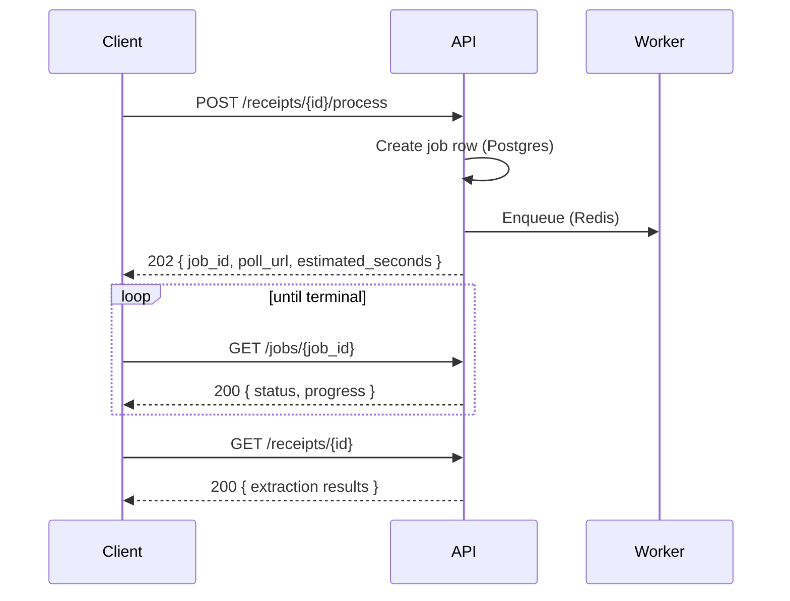

# Frugal — API Design

**Version:** 1.0 · **Base path:** `/api/v1` · **Last updated:** 2026-08-04
**Companion documents:** [SRS](01-srs.md) · [Architecture](02-architecture.md) · [Data model](03-data-model.md)

---

## 1. Design principles

| Principle | Application |
|---|---|
| **Resource-oriented REST** | Nouns as paths, HTTP verbs for actions. Non-CRUD operations are sub-resources (`/receipts/{id}/commit`), not verbs in query strings. |
| **Versioned from the first commit** | `/api/v1`. Retrofitting a version prefix after clients exist is a breaking change. |
| **One error envelope** | Every non-2xx response has an identical shape, so the client has exactly one error path. |
| **Explicit async** | Anything exceeding ~2 s returns `202` with a job handle. No endpoint blocks on OCR or a Prophet fit. |
| **Typed end to end** | FastAPI emits OpenAPI 3.1; the frontend generates TypeScript from it. Contract drift becomes a compile error. |
| **Cursor pagination on ledgers** | Offset pagination skips or duplicates rows when data is inserted mid-scroll — unacceptable on a transaction list. |
| **`Explanation` is uniform** | Five engines return the identical envelope, so one client component renders all of them. |

---

## 2. Conventions

### 2.1 Authentication

```http
Authorization: Bearer <access_token>        # 15-minute, in-memory
Cookie: frugal_refresh=<token>              # httpOnly · Secure · SameSite=Lax · /api/v1/auth
```

Only `/auth/refresh` and `/auth/logout` read the cookie. All other endpoints use the bearer token, so
CSRF surface is limited to those two paths, which additionally require a double-submit token.

### 2.2 Standard headers

| Header | Direction | Purpose |
|---|---|---|
| `X-Request-ID` | both | Client-supplied or generated; echoed on every response and propagated into Celery jobs. |
| `Idempotency-Key` | request | Required on `POST` for financial mutations and imports. Replay returns the original response. |
| `X-RateLimit-Remaining` / `-Reset` | response | Present on rate-limited routes. |

### 2.3 Error envelope

```jsonc
{
  "error": {
    "code": "VALIDATION_ERROR",           // stable, machine-readable
    "message": "Amount must be greater than zero.",
    "details": [
      { "field": "amount", "issue": "must be > 0", "value": "-50.00" }
    ],
    "request_id": "01J8X2K9...",
    "docs_url": "https://docs.frugal.app/errors/VALIDATION_ERROR"
  }
}
```

| HTTP | Code | Meaning |
|---|---|---|
| 400 | `VALIDATION_ERROR` | Malformed or semantically invalid input |
| 401 | `UNAUTHENTICATED` | Missing/expired access token |
| 401 | `TOKEN_REUSE_DETECTED` | Replayed refresh token; family revoked, re-login required |
| 403 | `FORBIDDEN` | Authenticated but not permitted |
| 404 | `NOT_FOUND` | Absent, or owned by another user — **deliberately indistinguishable** |
| 409 | `CONFLICT` | Uniqueness violation (duplicate transaction, duplicate budget period) |
| 422 | `UNPROCESSABLE` | Well-formed but rejected by a domain rule |
| 429 | `RATE_LIMITED` | Includes `Retry-After` |
| 500 | `INTERNAL_ERROR` | Never leaks internals; `request_id` is the support handle |
| 503 | `INSUFFICIENT_DATA` | Engine cannot produce an honest result; body carries `caveats` |

Two are worth dwelling on:

**404 for another user's resource.** Returning 403 confirms the ID exists, which is an enumeration
oracle across the whole system.

**503 `INSUFFICIENT_DATA`.** A distinct status for "I could fabricate a number but it would be
meaningless" is the API-level expression of the product thesis. The engine refuses rather than guesses,
and the client renders the caveats instead of a fake chart.

### 2.4 Pagination

Cursor-based on `transactions`, `receipts`, and `insights`; offset elsewhere.

```jsonc
{
  "data": [ /* … */ ],
  "pagination": { "next_cursor": "eyJvIjoi...", "has_more": true, "limit": 50 }
}
```

The cursor encodes `(occurred_on, id)`, matching `ix_transactions_user_date` exactly — the keyset
predicate is an index range scan regardless of how deep the user scrolls.

### 2.5 Money in JSON

```jsonc
{ "amount": "1250.00", "currency": "INR" }
```

**Strings, not numbers.** `JSON.parse` produces an IEEE-754 double; `1250.10` is not representable
exactly, and financial values must survive a round trip unchanged. Amounts are parsed into `Decimal`
server-side and a decimal library client-side.

### 2.6 Dates

`occurred_on`-style fields are `YYYY-MM-DD` (calendar dates). All instants are RFC 3339 UTC with `Z`.
Conversion to the user's timezone happens in the browser.

---

## 3. Endpoint catalogue

### 3.1 Authentication — `/auth` (M1)

| Method | Path | Description | Codes |
|---|---|---|---|
| POST | `/auth/register` | Create account; returns tokens | 201, 409, 429 |
| POST | `/auth/login` | Email + password | 200, 401, 429 |
| POST | `/auth/refresh` | Rotate refresh token (cookie) | 200, 401 |
| POST | `/auth/logout` | Revoke token family | 204 |
| GET | `/auth/oauth/google` | Begin OAuth flow | 302 |
| GET | `/auth/oauth/google/callback` | Complete OAuth | 302 |
| GET | `/auth/me` | Current user profile | 200, 401 |
| PATCH | `/auth/me` | Update profile/preferences | 200, 400 |
| DELETE | `/auth/me` | Delete account and all data | 202 |

```jsonc
// POST /auth/login → 200
{
  "access_token": "eyJhbG...",
  "token_type": "bearer",
  "expires_in": 900,
  "user": {
    "id": "01J8X...", "email": "priya@example.com", "display_name": "Priya",
    "base_currency": "INR", "timezone": "Asia/Kolkata", "is_demo_seeded": false
  }
}
// Set-Cookie: frugal_refresh=...; HttpOnly; Secure; SameSite=Lax; Path=/api/v1/auth; Max-Age=2592000
```

Rate limits: register 5/hour/IP · login 10/15 min/IP **and** 5/15 min/account · refresh 60/hour/user.
The per-account login limit is what actually blunts credential stuffing; per-IP alone is trivially
defeated by a botnet.

`DELETE /auth/me` returns `202` because S3 object deletion is asynchronous (FR-1.8).

### 3.2 Accounts — `/accounts` (M2)

| Method | Path | Description |
|---|---|---|
| GET | `/accounts` | List (`?include_archived=`) |
| POST | `/accounts` | Create |
| GET | `/accounts/{id}` | Detail with computed balance |
| PATCH | `/accounts/{id}` | Update |
| DELETE | `/accounts/{id}` | Soft delete (409 if transactions exist and `?force=false`) |
| POST | `/accounts/{id}/archive` | Archive without deleting |

### 3.3 Categories — `/categories` (M2)

| Method | Path | Description |
|---|---|---|
| GET | `/categories` | System + user categories, as a tree |
| POST | `/categories` | Create custom |
| PATCH | `/categories/{id}` | Update (custom only; 403 on system) |
| DELETE | `/categories/{id}` | Delete; `?reassign_to=` required if in use |

### 3.4 Transactions — `/transactions` (M2)

| Method | Path | Description | Codes |
|---|---|---|---|
| GET | `/transactions` | Cursor-paginated, filtered | 200 |
| POST | `/transactions` | Create (`Idempotency-Key` required) | 201, 409 |
| GET | `/transactions/{id}` | Detail | 200, 404 |
| PATCH | `/transactions/{id}` | Update | 200 |
| DELETE | `/transactions/{id}` | Soft delete | 204 |
| POST | `/transactions/bulk` | Up to 500 in one transaction | 201, 207 |
| POST | `/transactions/{id}/categorize` | Accept/override category → feedback | 200 |
| GET | `/transactions/uncategorized` | Review queue | 200 |

Filters: `from`, `to`, `account_id`, `category_id[]`, `kind`, `min_amount`, `max_amount`, `q`
(trigram merchant search), `source`, `is_reviewed`.

```jsonc
// POST /transactions → 201
{
  "id": "01J8X...", "kind": "expense",
  "amount": "1250.00", "currency": "INR",
  "occurred_on": "2026-08-03",
  "merchant_raw": "SWIGGY*ORDER 88213", "merchant_normalized": "swiggy",
  "category": { "id": "01J8A...", "name": "Food Delivery", "slug": "food-delivery" },
  "category_confidence": "0.94", "categorizer_version": "tfidf-lr-v3",
  "account_id": "01J8B...", "source": "manual", "is_reviewed": true
}
```

`POST /transactions/bulk` returns `207 Multi-Status` when some rows fail, with per-row results — a
partial CSV import must not be all-or-nothing at 500 rows, and the user needs to know exactly which
rows were rejected.

### 3.5 Import — `/imports` (M2)

| Method | Path | Description | Codes |
|---|---|---|---|
| POST | `/imports/csv/analyze` | Upload → detect columns, preview 20 rows | 200 |
| POST | `/imports/csv/commit` | Apply mapping, import with dedupe | 202 |
| GET | `/imports/{id}` | Status + per-row outcomes | 200 |
| POST | `/imports/demo-seed` | **Seed 12 months of demo data** | 202 |

```jsonc
// POST /imports/csv/analyze → 200
{
  "import_id": "01J8X...",
  "detected_mapping": { "date": "Txn Date", "amount": "Withdrawal", "merchant": "Narration" },
  "confidence": "0.88",
  "preview": [ /* 20 parsed rows */ ],
  "warnings": ["3 rows have unparseable dates"],
  "duplicate_estimate": 12
}
```

Two-phase by design: `duplicate_estimate` tells the user before committing that 12 of their rows are
already present, which is the difference between trusting the importer and fearing it.

`POST /imports/demo-seed` is a first-class endpoint, not a fixture script — it is the answer to cold
start (FR-2.10) and the fastest path to a demonstrable product.

### 3.6 Budgets & goals — `/budgets`, `/goals` (M2)

| Method | Path | Description |
|---|---|---|
| GET | `/budgets?period_start=` | Budgets with spend and pace |
| POST | `/budgets` | Create (409 on duplicate category+period) |
| PATCH/DELETE | `/budgets/{id}` | Update / remove |
| POST | `/budgets/copy-from-previous` | Roll last month's budgets forward |
| GET | `/goals` | List with progress and projected completion |
| POST/PATCH/DELETE | `/goals[/{id}]` | Manage |
| POST | `/goals/{id}/contribute` | Record a contribution |

### 3.7 Recurring items — `/recurring` (M2/M7)

| Method | Path | Description |
|---|---|---|
| GET | `/recurring` | List (`?item_type=`, `?is_active=`) |
| POST/PATCH/DELETE | `/recurring[/{id}]` | Manage |
| GET | `/recurring/detected` | Auto-detected candidates pending confirmation |
| POST | `/recurring/detected/{id}/confirm` | Promote candidate to a tracked item |
| GET | `/recurring/upcoming?days=30` | Obligations in the window |

Detected recurrences are proposed, never silently created. An auto-created "subscription" the user
never confirmed would then silently distort their forecast.

### 3.8 Analytics — `/analytics` (M3)

| Method | Path | Description |
|---|---|---|
| GET | `/analytics/dashboard` | Every dashboard widget in one payload |
| GET | `/analytics/categories` | Breakdown with period-over-period delta |
| GET | `/analytics/cashflow` | Income vs. expense series |
| GET | `/analytics/net-worth` | Net-worth trend |
| GET | `/analytics/savings-rate` | Savings-rate trend |
| GET | `/analytics/budget-status` | Per-budget progress and pace |

`/analytics/dashboard` is intentionally a composite endpoint. Six parallel requests on a cold mobile
connection is six TLS-warm round trips for one screen; one server-side gather is measurably faster and
the payload is cached under `data_version`.

```jsonc
// GET /analytics/dashboard?period=2026-08 → 200
{
  "period": { "start": "2026-08-01", "end": "2026-08-31" },
  "net_worth": { "amount": "482300.00", "currency": "INR", "change_pct": "2.4" },
  "income_mtd": { "amount": "85000.00", "currency": "INR" },
  "expense_mtd": { "amount": "41250.00", "currency": "INR" },
  "savings_rate": { "value": "0.514", "change_pct": "6.1" },
  "health_score": { "score": "72.50", "risk_level": "low", "confidence": "0.81" },
  "top_categories": [ { "category": "Food", "amount": "12400.00", "pct": "30.1" } ],
  "budget_summary": { "total_limit": "50000.00", "spent": "41250.00", "over_budget_count": 1 },
  "data_version": 4821
}
```

### 3.9 Receipts — `/receipts` (M4)

| Method | Path | Description | Codes |
|---|---|---|---|
| POST | `/receipts/upload-url` | Presigned S3 PUT + receipt record | 201 |
| POST | `/receipts/{id}/process` | Enqueue OCR | 202 |
| GET | `/receipts` | List (`?status=`) | 200 |
| GET | `/receipts/{id}` | Extraction + per-field confidence | 200 |
| GET | `/receipts/{id}/image-url` | Presigned GET (5 min) | 200 |
| PATCH | `/receipts/{id}/fields` | Submit corrections | 200 |
| POST | `/receipts/{id}/commit` | Create transaction | 201, 409 |
| DELETE | `/receipts/{id}` | Delete record + S3 object | 204 |

```jsonc
// GET /receipts/{id} → 200
{
  "id": "01J8X...", "status": "needs_review", "overall_confidence": "0.71",
  "fields": [
    { "field_name": "merchant", "raw_text": "RELIANCE FRESH", "parsed_value": "Reliance Fresh",
      "confidence": "0.96", "needs_review": false, "bbox": {"x":42,"y":18,"w":210,"h":34} },
    { "field_name": "total", "raw_text": "1,2S0.00", "parsed_value": "1250.00",
      "confidence": "0.58", "needs_review": true, "bbox": {"x":310,"y":540,"w":120,"h":28} },
    { "field_name": "date", "raw_text": "03/08/2026", "parsed_value": "2026-08-03",
      "confidence": "0.91", "needs_review": false, "bbox": {"x":40,"y":72,"w":150,"h":26} }
  ],
  "line_items": [ /* … */ ],
  "duplicate_candidates": [
    { "transaction_id": "01J8W...", "occurred_on": "2026-08-03",
      "amount": "1250.00", "similarity": "0.94" }
  ]
}
```

Note `raw_text: "1,2S0.00"` — Tesseract read `S` for `5`. Confidence drops to 0.58 and only that field
is flagged. Returning `raw_text`, `parsed_value`, `confidence`, and `bbox` per field is what lets the UI
highlight the exact region and ask one targeted question rather than demanding wholesale re-verification.

`duplicate_candidates` surfaces before commit (FR-4.7), so the user resolves the collision rather than
discovering a double-counted expense later.

`POST /receipts/{id}/commit` returns `409` if a required field is still below threshold — FR-4.5
enforced at the API boundary, not merely in the UI.

### 3.10 Financial health — `/health-score` (M6)

| Method | Path | Description |
|---|---|---|
| GET | `/health-score` | Current score with full decomposition |
| GET | `/health-score/history?months=12` | Trend |
| GET | `/health-score/rubric` | **Published weights and bands** |

```jsonc
// GET /health-score → 200
{
  "score": "72.50", "risk_level": "low", "confidence": "0.81",
  "rubric_version": "v1",
  "explanation": {
    "verdict": "HEALTHY", "score": "72.50", "confidence": "0.81",
    "method": "rubric_v1",
    "data_window": { "start": "2025-08-01", "end": "2026-08-04", "observation_days": 368 },
    "factors": [
      { "name": "Savings rate", "value": "51.4%", "raw_value": "0.514",
        "weight": "0.25", "contribution": "22.10", "direction": "positive",
        "explanation": "You save 51% of income, well above the 20% healthy threshold." },
      { "name": "Emergency fund", "value": "3.2 months", "raw_value": "3.2",
        "weight": "0.25", "contribution": "13.30", "direction": "negative",
        "explanation": "Covers 3.2 months of expenses; 6 months is the target." },
      { "name": "Debt-to-income", "value": "18%", "raw_value": "0.18",
        "weight": "0.20", "contribution": "16.00", "direction": "positive",
        "explanation": "EMIs consume 18% of income, comfortably below the 36% ceiling." },
      { "name": "Budget discipline", "value": "4 of 5 kept", "raw_value": "0.80",
        "weight": "0.15", "contribution": "10.80", "direction": "positive",
        "explanation": "You stayed within 4 of 5 budgets over the last 3 months." },
      { "name": "Cash-flow stability", "value": "moderate", "raw_value": "0.62",
        "weight": "0.10", "contribution": "6.20", "direction": "neutral",
        "explanation": "Month-to-month balance varies moderately." },
      { "name": "Financial growth", "value": "+2.4%/mo", "raw_value": "0.024",
        "weight": "0.05", "contribution": "4.10", "direction": "positive",
        "explanation": "Net worth is growing 2.4% per month." }
    ],
    "caveats": [],
    "computed_at": "2026-08-04T09:12:00Z"
  }
}
```

Weights sum to 1.00 and contributions sum to the score. **This is checked by a test**, because a rubric
whose parts don't reconstruct the whole is not an explanation — it is a decoration.

`GET /health-score/rubric` exists so the scoring model is inspectable without reverse-engineering it
from outputs. A user who disagrees with their score can see exactly what produced it.

### 3.11 Insights — `/insights` (M6)

| Method | Path | Description |
|---|---|---|
| GET | `/insights` | Ranked by materiality (`?severity=`, `?unread=`) |
| POST | `/insights/{id}/read` | Mark read |
| POST | `/insights/{id}/dismiss` | Dismiss + suppress recurrence |
| POST | `/insights/refresh` | Force regeneration (202) |

### 3.12 Forecasting — `/forecast` (M7)

| Method | Path | Description | Codes |
|---|---|---|---|
| GET | `/forecast?horizon_days=90` | Cash-flow forecast | 200, 503 |
| POST | `/forecast/scenario` | Forecast with hypothetical events | 200 |
| GET | `/forecast/shortfalls` | Projected shortfall dates | 200 |

```jsonc
// GET /forecast?horizon_days=90 → 200
{
  "horizon_days": 90, "method": "ewma_seasonal", "observation_days": 142,
  "confidence": "0.65",
  "projected_balance_end": { "amount": "128400.00", "currency": "INR" },
  "trough": { "amount": "42100.00", "on": "2026-09-28" },
  "shortfall_dates": [],
  "series": [ { "date": "2026-08-05", "p10": "98200.00", "p50": "101400.00", "p90": "104600.00" } ],
  "explanation": {
    "method": "ewma_seasonal",
    "data_window": { "start": "2026-03-15", "end": "2026-08-04", "observation_days": 142 },
    "confidence": "0.65",
    "factors": [
      { "name": "Recurring income", "value": "₹85,000/mo", "weight": "0.40",
        "contribution": "0.00", "direction": "positive",
        "explanation": "Salary detected on the 1st with 0.02 variance." },
      { "name": "Committed outflows", "value": "₹32,400/mo", "weight": "0.35",
        "contribution": "0.00", "direction": "negative",
        "explanation": "Rent, 2 EMIs, and 4 subscriptions." },
      { "name": "Discretionary (EWMA)", "value": "₹18,900/mo", "weight": "0.25",
        "contribution": "0.00", "direction": "negative",
        "explanation": "Exponentially weighted mean over 142 days." }
    ],
    "caveats": [
      "142 days of history — below the 180 days needed for seasonal modelling.",
      "Annual patterns such as festival spending are not captured yet."
    ]
  }
}
```

The `caveats` array is the honesty mechanism. This user gets EWMA, not Prophet, and the response says
so plainly. Compare the alternative: a Prophet curve fitted to 142 days would look identical in the UI
while being far less trustworthy.

Under 14 days of data the endpoint returns **503 `INSUFFICIENT_DATA`** with caveats and no series. It
declines rather than inventing.

### 3.13 Purchase advisor — `/advisor` (M8)

| Method | Path | Description |
|---|---|---|
| POST | `/advisor/evaluate` | Evaluate a purchase intent |
| GET | `/advisor/evaluations` | History |
| GET | `/advisor/evaluations/{id}` | Stored evaluation |
| GET | `/advisor/products/search?q=` | Search catalogue via `PriceProvider` |
| GET | `/advisor/products/{id}/prices` | Current price points |

```jsonc
// POST /advisor/evaluate
{ "product_query": "MacBook Air M3 16GB", "price": "134900.00",
  "currency": "INR", "product_id": "01J8P...", "consider_emi": true }
```

```jsonc
// → 200
{
  "id": "01J8Y...",
  "verdict": "wait",
  "affordability_score": "48.20",
  "confidence": "0.77",
  "affordable_from": "2026-11-15",
  "simulation": {
    "before": { "liquid_savings": "182000.00", "emergency_fund_months": "3.2",
                "health_score": "72.50", "savings_rate": "0.514" },
    "after":  { "liquid_savings": "47100.00", "emergency_fund_months": "0.8",
                "health_score": "54.10", "savings_rate": "0.514" },
    "goal_impact": [
      { "goal": "Emergency Fund", "delay_days": 214, "priority": 1 },
      { "goal": "Japan Trip",     "delay_days": 96,  "priority": 3 }
    ],
    "forecast_trough_after": { "amount": "11200.00", "on": "2026-09-28" }
  },
  "emi_options": [
    { "tenure_months": 12, "monthly": "11800.00", "total_interest": "6700.00",
      "new_debt_ratio": "0.32", "affordability_score": "66.40" },
    { "tenure_months": 24, "monthly": "6200.00",  "total_interest": "13900.00",
      "new_debt_ratio": "0.25", "affordability_score": "71.90" }
  ],
  "alternatives": [
    { "product_id": "01J8Q...", "name": "MacBook Air M2 16GB",
      "price": "94900.00", "affordability_score": "68.30", "verdict_if_chosen": "buy_on_emi" }
  ],
  "explanation": {
    "verdict": "WAIT", "score": "48.20", "confidence": "0.77", "method": "rubric_v1",
    "data_window": { "start": "2026-03-15", "end": "2026-08-04", "observation_days": 142 },
    "factors": [
      { "name": "Emergency fund after purchase", "value": "0.8 months", "raw_value": "0.8",
        "weight": "0.30", "contribution": "-24.00", "direction": "negative",
        "explanation": "Buying now drops your emergency fund from 3.2 to 0.8 months, below the 3-month floor." },
      { "name": "Forecast trough", "value": "₹11,200 on 28 Sep", "raw_value": "11200.00",
        "weight": "0.20", "contribution": "-8.40", "direction": "negative",
        "explanation": "Your lowest projected balance leaves little margin for an unexpected expense." },
      { "name": "Savings rate", "value": "51.4%", "raw_value": "0.514",
        "weight": "0.15", "contribution": "13.50", "direction": "positive",
        "explanation": "A strong savings rate means you rebuild quickly — hence WAIT, not NOT_RECOMMENDED." },
      { "name": "Debt-to-income", "value": "18%", "raw_value": "0.18",
        "weight": "0.15", "contribution": "11.20", "direction": "positive",
        "explanation": "Existing EMI load is low, so an EMI route is viable." },
      { "name": "Goal delay", "value": "214 days (priority 1)", "raw_value": "214",
        "weight": "0.20", "contribution": "-9.60", "direction": "negative",
        "explanation": "Delays your highest-priority goal by roughly 7 months." }
    ],
    "caveats": [
      "Based on 142 days of history; seasonal spending is not yet modelled.",
      "Assumes income continues at its current level."
    ],
    "computed_at": "2026-08-04T09:14:22Z"
  }
}
```

This payload is the product in one response. Every claim traces to a factor, `WAIT` carries a date,
the EMI path is priced honestly with total interest, and the caveats state what the model does not
know. The third factor is worth noting specifically: it explains *why the verdict is `WAIT` rather
than `NOT_RECOMMENDED`* — the contrast is what makes the recommendation actionable rather than merely
discouraging.

### 3.14 Jobs & system

| Method | Path | Description |
|---|---|---|
| GET | `/jobs/{id}` | Job status, attempts, error |
| GET | `/health` | Liveness (no auth) |
| GET | `/health/ready` | DB + Redis readiness (no auth) |
| GET | `/openapi.json` | OpenAPI 3.1 schema |

```jsonc
// GET /jobs/{id} → 200
{ "id": "01J8Z...", "task_name": "process_receipt", "status": "running",
  "attempts": 1, "progress": { "stage": "ocr", "pct": 60 },
  "started_at": "2026-08-04T09:15:01Z", "result": null, "error": null }
```

---

## 4. Async operation pattern

Every long operation follows one shape, so the client has a single implementation:



`202` bodies always carry `job_id`, `poll_url`, and `estimated_seconds` so the client can render a
meaningful progress state rather than an indefinite spinner. Polling backs off: 1 s → 2 s → 5 s, capped
at 5 s.

---

## 5. Idempotency

Required on `POST /transactions`, `/transactions/bulk`, `/imports/csv/commit`, `/receipts/{id}/commit`,
and `/goals/{id}/contribute`.

The key is stored with a hash of the request body and the original response. A replay with a matching
body returns the stored response with `Idempotency-Replayed: true`; a replay with a *different* body
returns `409` — that combination means a client bug, and silently accepting it would corrupt financial
data. Keys expire after 24 hours.

This complements the database-level `content_hash` constraint: idempotency keys protect against
duplicate *requests* (retries, double-clicks), while `content_hash` protects against duplicate *data*
(re-importing the same statement). Both are needed; neither substitutes for the other.

---

## 6. Rate limits

| Scope | Limit |
|---|---|
| Auth: register | 5/hour/IP |
| Auth: login | 10/15 min/IP · 5/15 min/account |
| Receipt upload | 30/hour/user |
| Advisor evaluate | 60/hour/user |
| Forecast refresh | 20/hour/user |
| Global authenticated | 300/min/user |

Enforced in Redis with a sliding window. Because the free Upstash tier allows 10k commands/day, the
limiter uses a single pipelined script per request rather than multiple round trips.

---

## 7. Client type generation

```
FastAPI  →  /openapi.json  →  openapi-typescript  →  src/lib/api/schema.d.ts
```

Generation runs in CI; a diff in the generated file that isn't committed fails the build. The frontend
never hand-writes a response interface, so a backend field rename surfaces as a TypeScript error rather
than a runtime `undefined` in production.

---

## 8. Versioning policy

**Non-breaking** (no version bump): new endpoints, new optional request fields, new response fields,
new enum values in fields documented as extensible.

**Breaking** (requires `/api/v2`): removing or renaming a field, changing a type, making an optional
field required, changing status-code semantics.

New `Explanation.factors` entries are explicitly non-breaking — clients must render the factor list
generically rather than switching on known factor names. This is stated in the schema description so
the constraint is discoverable, and it is what allows rubrics to evolve without a version bump.

---

*Next: [05-ui-wireframes.md](05-ui-wireframes.md)*
