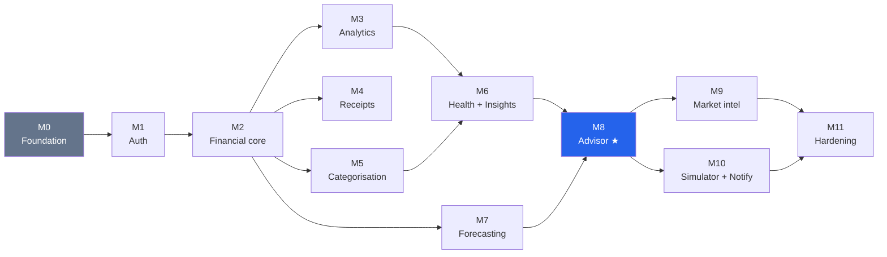

# Frugal — Development Roadmap

**Version:** 1.0 · **Last updated:** 2026-08-04
**Companion documents:** [SRS](01-srs.md) · [Architecture](02-architecture.md) · [Project structure](06-project-structure.md)

---

## 1. Sequencing principles

| Principle | Consequence |
|---|---|
| **Every milestone is demoable** | No milestone delivers only backend plumbing. Each one ends with something a person can use. |
| **Every milestone is deployable** | The `main` branch is always releasable. There is no long-lived integration branch. |
| **Dependencies flow forward, never backward** | A milestone never requires revisiting a completed one. Where a later engine needs a hook, that hook is built in the earlier milestone. |
| **Riskiest assumption first within a track** | Inside a milestone, the piece most likely to be wrong is built first, while there is still time to change course. |
| **AI milestones ship with an eval harness** | A model without a measured baseline cannot be improved or safely changed. The harness lands with the model, not after. |

Each milestone ends at a **confirmation gate**: work stops, exit criteria are demonstrated, and the
next milestone begins only on approval.

---

## 2. Dependency graph

M2 is the hinge — four milestones depend on it directly. It gets the most careful review, because a
schema mistake there propagates into every engine downstream.

M4 and M5 are independent of each other and of M3; if progress stalls on OCR tuning, analytics and
categorisation can proceed in parallel rather than blocking.

---

## 3. v1 milestones

### M0 — Foundation

*Goal: a running, tested, deployable skeleton. No features.*

**Deliverables**
- Monorepo scaffold per [project structure](06-project-structure.md)
- `docker-compose.yml`: api · worker · beat · postgres · redis · minio
- `Settings` with boot-time validation; `.env.example`
- Async + sync engines, `Base` and mixins, Alembic baseline
- `core/`: `Money`, `Explanation`, `BaseRepository`, error envelope, structured logging with request ID
- `/health` and `/health/ready`
- CI: ruff · mypy · import-linter · pytest against real Postgres/Redis
- Next.js 16 scaffold, Tailwind, shadcn, theme provider with dark/light
- `make` targets

**Exit criteria**
- `docker compose up` → all six services healthy
- `alembic upgrade head` → clean on an empty database
- `make check` green
- `GET /health/ready` returns DB and Redis status
- Frontend renders a themed shell and toggles dark/light
- **`Explanation` rejects a score with an empty `factors` list** — the product's central invariant is enforced before any engine exists

> Building `Explanation`, `Money`, and `BaseRepository` in M0 rather than when first needed is
> deliberate. Each is a cross-cutting invariant, and retrofitting any of the three across eight
> modules is far more expensive than starting with them.

---

### M1 — Authentication & tenancy

*Goal: users exist, sessions are secure, and tenant isolation is structurally guaranteed.*

**Deliverables**
- `users`, `refresh_tokens`; Argon2id hashing
- Register · login · refresh with rotation and reuse detection · logout
- Access token (15 min, in memory) + refresh cookie (httpOnly, Secure, SameSite=Lax)
- Google OAuth with account linking
- `GET/PATCH/DELETE /auth/me`
- Rate limiting (Redis sliding window), per IP and per account
- `BaseRepository` tenant scoping wired into the dependency graph
- `audit_log` for auth events
- Frontend: login, register, protected routes, silent refresh, logout

**Exit criteria**
- Register → login → refresh → logout works end to end
- **Replaying a used refresh token revokes the whole family** (tested)
- **A test enumerates every repository method and asserts each emits a `user_id` predicate**
- Rate limits return `429` with `Retry-After`
- Access token never touches `localStorage` or `sessionStorage` (asserted in an E2E test)
- Account deletion removes all user rows
- Playwright: full auth journey

---

### M2 — Financial core

*Goal: the data foundation every engine reads, plus the answer to cold start.*

**Deliverables**
- `accounts`, `categories`, `transactions`, `budgets`, `goals`, `recurring_items`
- Full CRUD; transfers as linked pairs excluded from income/expense aggregates
- System category taxonomy (two levels) seeded
- `content_hash` + unique index; idempotency-key middleware
- CSV import: analyse → map → preview → commit, with duplicate estimation
- `POST /transactions/bulk` returning `207` with per-row outcomes
- **Demo seeder** — 12 months of realistic, statistically plausible data
- Materialised `current_balance` + nightly reconciliation job
- Frontend: transaction list (cursor-paginated), quick add, CSV wizard, accounts, budgets, goals, empty state

**Exit criteria**
- Importing a CSV twice creates **zero duplicates** (tested at the database level, not only the service)
- 500-row bulk insert with 3 invalid rows → `207`, 497 committed, 3 reported with reasons
- Demo seeder produces 12 months in < 5 s, with realistic recurring salary, rent, EMIs, and seasonal variation
- Transfers do not appear in income or expense totals
- Balance reconciliation reports zero drift
- No `Float` column exists on any model (asserted)
- Playwright: import CSV → see transactions → edit → delete

> **Seeder quality is a first-class concern.** It must produce data that is *statistically plausible* —
> salary on a fixed day, rent with low variance, discretionary spend with realistic dispersion,
> occasional large purchases. Uniform random noise would make every downstream engine look wrong when
> the engine is fine and the data is not.

---

### M3 — Analytics

*Goal: the dashboard becomes real, with the chart system that every later milestone reuses.*

**Deliverables**
- Aggregation service: single-query-per-widget, no client-side aggregation
- `/analytics/*` endpoints, including the composite `/dashboard`
- Redis read-through cache keyed on `data_version`
- Chart component library per [§2.2 of the design doc](05-ui-wireframes.md): line, grouped bar, stacked bar, meter, sparkline, dumbbell
- `chart-container` enforcing the light-mode direct-label obligation
- Table view + text summary on every chart
- Dashboard, category drill-down, cash flow, net worth, savings-rate trend
- Date-range filter propagating to every widget

**Exit criteria**
- Dashboard renders in < 1.5 s FCP on simulated 4G with 2,400 transactions
- A transaction write bumps `data_version` and invalidates the cache
- Every chart has a keyboard-reachable table view and a screen-reader summary
- Charts render correctly in both themes (dark mode validated against the dark surface, not flipped)
- **No dual-axis chart exists anywhere** (design review gate)
- Aggregates match hand-computed values on a fixture dataset

---

### M4 — Receipt intelligence

*Goal: photo → reviewed transaction, with confidence surfaced per field.*

**Deliverables**
- `receipts`, `receipt_fields`, `receipt_line_items`, `jobs`
- Presigned S3/MinIO upload — bytes never transit the API
- OpenCV pipeline: perspective correction → deskew → denoise → adaptive threshold
- Tesseract via `image_to_data` for per-token confidence
- Field extraction: merchant, date, total, tax, line items, each with confidence and `bbox`
- Threshold routing to the review queue; commit blocked below threshold
- Duplicate detection before commit
- Celery task with retry, backoff, dead-lettering; job status polling
- Frontend: upload, status polling, side-by-side review UI with region highlighting

**Exit criteria**
- 20 labelled fixture receipts processed; **field-level extraction rate recorded as a baseline**
- Low-confidence field is flagged and blocks commit; API returns `409` if forced
- Review UI highlights the correct image region per field
- Duplicate candidate surfaces before commit
- OCR job completes < 30 s p95 for a 5 MP image
- Worker memory stays under 450 MB during processing (measured)
- Failed job lands in the dead-letter table with the exception preserved

> The eval baseline matters more than the absolute number. ~65% field accuracy with a working review
> flow is a shipped feature; 80% accuracy with no review flow is a liability.

---

### M5 — Categorisation ML

*Goal: transactions categorise themselves, and corrections make the system better.*

**Deliverables**
- Merchant normaliser (terminal IDs, city codes, reference numbers)
- Deterministic rules layer, evaluated before the model
- TF-IDF (word + char n-gram) → logistic regression over the taxonomy
- Confidence thresholding → "uncategorised, needs review" rather than a guess
- `categorization_feedback`: corrections become personal rules and training labels
- Versioned model artefacts; `categorizer_version` recorded per prediction
- **Offline eval harness**: accuracy, macro-F1, per-class confusion
- Retraining task; frontend inline category picker and review queue

**Exit criteria** — all met; measured figures in [08-eval-baselines.md](08-eval-baselines.md)
- ✅ Eval harness reports accuracy and macro-F1 on a held-out set, recorded as the baseline
- ⚠️ ~~Macro-F1 ≥ 0.75 on the seeded taxonomy~~ — superseded. The first harness scored 100%,
  which exposed the *test* as wrong rather than the model as good: every "held-out" merchant
  contained a seed brand as a substring. Split into two tiers that answer different questions:
  **Tier A** (known merchants, mangled bank narrations — the everyday case) macro-F1 **1.000**;
  **Tier B** (brands absent from the corpus — true generalisation) macro-F1 **0.349**. One number
  could not have honestly described both. The clause asked for *a recorded, defensible number*;
  these are two, and they are defensible.
- ✅ A user correction immediately creates a rule; the same merchant categorises correctly next time
- ✅ Low-confidence predictions surface as uncategorised rather than as a wrong guess
- ✅ Model artefact is versioned and the version is stored on every prediction
- ✅ `make eval` prints the metrics table

**Found while building**
- The confidence threshold shipped at `0.60`, chosen by intuition and wrong by roughly an order
  of magnitude: across 23 classes a *correct* top class often sits near 0.35, so it accepted 8%
  of predictions. Recalibrated to `0.30` against a measured precision/coverage curve — 28%
  coverage at 91% precision. The sweep is now a test, so the value has a table behind it.
- Confirming a suggestion was discarded, so the loop only ever learned from its mistakes.
  Confirmations of *model* predictions are now recorded as training labels too.
- The demo seeder blanked categories to populate the review queue, but that produces
  *uncategorised* rows, not *suggestions* — the queue would have been empty on a fresh demo.
  Those rows now run through the categoriser.

---

### M6 — Financial health & insights

*Goal: the first fully explained engine — the template for every one that follows.*

**Deliverables**
- Six sub-metric calculators: savings rate, emergency fund, debt-to-income, budget discipline, cash-flow stability, growth
- Versioned rubric with published weights and bands
- Composite scoring → `Explanation` with all six factors
- `health_snapshots` persisted daily for trends
- `GET /health-score/rubric` — the published rubric
- Insight detectors: category spike, budget breach, new recurring, subscription creep, savings-rate change, anomalous transaction, emergency-fund low, goal at risk
- Materiality ranking, `dedup_key` suppression, dismissal with cooling period
- Frontend: health page with factor decomposition, insight feed, `<ExplanationPanel>` in production use

**Exit criteria** — all met
- ✅ **Weights sum to 1.00 and contributions sum to the score**, asserted by test and re-asserted
  over the wire (a float round-trip would break it in the hardest way to notice)
- ✅ Every sub-metric returns value, weight, contribution, direction, and plain-language explanation
- ✅ Insufficient data yields a partial score with explicit caveats — never a fabricated number
- ✅ Running the insight engine twice produces **no duplicate insights**, enforced by a unique
  constraint on `(user_id, dedup_key, period_start)` rather than by detector discipline
- ✅ Insights are ranked by materiality (₹impact × confidence) and capped at 8 per run
- ✅ `<ExplanationPanel>` renders health output with zero engine-specific code — the same
  component renders `rubric_v1` and `rule_v1` output, verified in the browser
- ✅ Golden-file tests pin explanation output for three fixture personas

**Design decisions worth recording**
- **A metric that cannot be measured is excluded, not zeroed.** Zeroing produces a confident,
  precise, wrong number that tells a six-week-old account their finances are in crisis. The
  weight is redistributed across the metrics that survived, so the score stays on a 0–100 scale
  and the omission is stated as a caveat. Without redistribution a user missing one metric would
  be capped at 85 forever, which reads as a judgement rather than as missing data.
- **A high score on thin evidence is not sold as "low risk".** Below 0.35 confidence the verdict
  is capped at *moderate*. The two errors do not cost the same: unearned reassurance invites
  someone to act on it, while "moderate, and here is why we are not sure yet" costs a healthy user
  nothing but patience.

**Found while building**
- **Liquid assets exceeded net worth** in the emergency-fund metric: `net_worth()[1]` sums liquid
  accounts and ignores credit-card debt, so ₹680k of savings against ₹190k owed scored as 11.2
  months of runway. Added `emergency_reserves()`, netting revolving debt. 11.2 → 8.1 months.
- **The percentage gate in the category-spike detector never fired.** `CategorySlice.change_pct` is
  a percentage (261.33) and every threshold in the detector is a fraction, so `261.33 < 0.40` was
  false for everything and any category clearing the ₹2,000 floor was reported however small the
  relative move. Normalised at the boundary; regression test pinned.
- **"Shopping spending is up 26133.0%"** — arithmetically correct on a ₹46 baseline and useless as
  a headline. Percentages are now quoted only above a ₹1,000 baseline; below it the change is
  stated in rupees. Sporadic categories (a laptop, a flight) hit this constantly.
- **Detectors compared month-to-date against month-to-date**, which on the 5th is five days against
  five days. The feed would have been near-empty in the first week of every month, exactly when
  someone would look. Switched to a trailing 30-day window.
- **Rounding drift capped a flawless user at 99.99.** Redistributed weights are irrational
  (1/0.85 = 1.17647…), so quantising each to four places left them summing to 0.9999. Remainder
  now allocated to the heaviest weight, so the parts reconstruct the score *exactly*.
- `<ExplanationPanel>` labelled insight factors "12,144.05 pts · weight 0.5". Points and weights
  decompose a *score*; an insight has none. The annotation is dropped where there is nothing to
  contribute to — caught by looking at the rendered page, not by any test.

---

### M7 — Cash-flow forecasting

*Goal: honest forward projection that degrades gracefully with sparse data.*

**Deliverables**
- Recurring-transaction detection: periodicity, amount stability, confidence
- Three tiers behind the `Forecaster` port: recurring projection · EWMA + seasonal naive · Prophet
- Tier selection by observation count; `method`, `data_window`, `confidence` in every response
- Confidence intervals (p10/p50/p90); trough and shortfall detection
- Prophet imported inside the tier-3 function only
- Caching on `data_version`; `503 INSUFFICIENT_DATA` below 14 days
- **Backtesting harness reporting MAPE per tier**
- Frontend: forecast chart with confidence band, method disclosure, caveats

**Exit criteria** — all met; measured figures in [08-eval-baselines.md](08-eval-baselines.md)
- ✅ Each tier selected correctly at 30 / 120 / 250 days of fixture data
- ✅ Response always names method, window, and confidence
- ✅ Under 14 days → `503 INSUFFICIENT_DATA` with caveats and no fabricated series
- ✅ Backtest reports MAPE per tier, recorded as a baseline
- ✅ **API process memory does not increase after a Prophet forecast runs** — proven in a
  stronger form than asked: Prophet is *absent from the API image*, so it cannot be imported at
  all. A lazy import that is merely usually-not-reached is one careless call from resident;
  leaving the package out of the build makes the property structural.
- ✅ Prophet fit completes well within the worker's ceiling (~0.5 s on 339 days of history)
- ✅ Frontend renders the band as one hue at 12% opacity, not a second series (asserted in the
  browser: exactly one stroked line on the chart)

**Design decisions worth recording**
- **Tier 3 is unreachable from a web request, by design.** The API serves tier 2 immediately,
  sets `refining: true`, and queues a worker job; the better forecast lands in `forecasts` and is
  served on the next read while its `data_version` still matches. Slower to converge than running
  Prophet inline, and the only version that fits in 1 GB.
- **A commitment is distinguished from a habit on two axes**, both reported: interval regularity
  and amount stability. Rent every month at ₹18,000 is a commitment; groceries every 6–9 days at
  varying amounts is a habit, and modelling it as a scheduled event would put money on specific
  days it never leaves on.

**Found while building**
- **Recurring commitments were counted twice.** The tiers lay scheduled events *over* a
  statistical baseline, but the baseline was computed from history that still contained salary and
  rent — so both were added again on their due dates. The demo user's 90-day projection implied
  ₹89,000/month of saving against a ~₹95,000 income. Caught only by feeding the backtest its real
  production inputs, which pushed 90-day MAPE from 31% to 77%; no unit test would have found it,
  because each half was individually correct. Fixed by projecting from a residual series
  (`_residual_history`); MAPE is now 2.7% (tier 1) and 1.4% (tier 2).
- **Every Celery task after the first failed** with "Future attached to a different loop". Both
  async globals — the SQLAlchemy engine and the Redis client — are `lru_cache`d and bind
  connections to the loop that opened them, while each task runs its own `asyncio.run()`. The
  *first* task in each worker process succeeded, so it read as an intermittent fault rather than a
  certainty. Fixed with `worker_async_session` (an engine the task owns and disposes) and
  `reset_redis`.
- **A perfectly regular history produced a zero-width confidence band** — the forecast claimed to
  know the next 90 days exactly. Real ledgers are rarely that clean, but a user with only salary
  and rent would hit it. The band is now floored at a fraction of typical daily flow: the past
  being clean is evidence about the past, and the future still contains a car repair.
- **Tier 2 told users with 339 days of history that they had "below the 180 days needed"** — it
  was on tier 2 because the API cannot run Prophet, not because history was short. A user who can
  see the statement is false discounts everything else in the response.
- **The backtest's own metric was wrong twice.** MAPE *falls* with horizon for a saver (the
  denominator grows faster than the error); mean-absolute-error also falls (it averages over the
  horizon, diluting the lumpy salary-timing miss that dominates). Terminal error — the gap at the
  right edge of the chart, which is what a user plans against — is the honest read. Separately,
  all three horizons being multiples of the monthly salary cycle made results phase-dependent
  until cut points were spread across a full cycle.
- **M6's `new_recurring` insight fired for the first time** once detection persisted its results,
  and immediately showed two faults of its own: it announced "New recurring charge: salary"
  (ranked *first*, because ₹1.02M annualised is the largest number in the ledger), and it treated
  every long-standing commitment as new because it read the row's creation date. Income is now
  excluded, and `recurring_items.first_seen_on` records when the pattern actually began.

---

### M8 — Smart Purchase Advisor ★

*Goal: the flagship. Every prior milestone converges into one answered question.*

**Deliverables**
- `PriceProvider` port; `SeedCatalogProvider` (~200 realistic products) + `ManualEntryProvider`
- `products`, `price_points`, `purchase_evaluations`
- Affordability rubric: seven weighted factors, versioned
- **Hard constraints that override the score** (emergency fund floor, negative forecast trough)
- Four verdicts; `WAIT` solves for an affordable-from date against the forecast
- Purchase impact simulation: before/after liquid savings, emergency fund, health score, savings rate, goal ETAs
- EMI modelling: tenure options, total interest, resulting debt ratio
- Cheaper alternatives from the catalogue
- Frontend: search, verdict card, dumbbell before/after, factor decomposition, EMI comparison, alternatives

**Exit criteria** — all met
- ✅ A **scenario matrix** of 20 user/price combinations produces the expected verdict for each
- ✅ Every verdict returns a non-empty factor list with weights summing to 1.00
- ✅ A `WAIT` verdict always carries `affordable_from`, enforced by the database check constraint
  (tested by attempting the insert directly, not only through the service)
- ⚠️ Hard constraints override a high score — **the criterion could not be satisfied as written,
  and that is a finding.** Constructing a user with a high weighted score whose emergency fund
  breaches the floor turns out to be impossible: the emergency-fund factor is weighted 0.25 and
  scores zero at the floor, while `cash_coverage` and `forecast_trough_after` fall with it, so
  three of seven factors collapse together and the score always drops with them. The weighting
  and the constraint agree, which is the outcome you want from two mechanisms aimed at one risk.
  The constraint still earns its place: it holds the floor if weights are ever retuned, and it
  names the reason in the response rather than leaving the user to infer it. Verified instead as
  *the constraint fires, caps the verdict, and is stated* — plus a separate case where a
  constraint genuinely does downgrade `BUY_NOW` to `BUY_ON_EMI`.
- ✅ EMI options show total interest against the cash price, and plans past the 43% debt ceiling
  are marked rather than hidden
- ✅ Impact simulation reconciles with the health and forecast engines called independently
  (asserted against the live `/health-score` and `/forecast` responses)
- ✅ p95 latency < 2 s — measured at **~30 ms**, with health and forecast gathered concurrently
- ✅ Playwright: search → evaluate → read explanation → compare EMI → evaluate an alternative

**Design decisions worth recording**
- **The score does not always decide.** A weighted rubric ranks *degrees* of affordability well
  and expresses "this would leave you three weeks of runway" badly. Six hard constraints cap the
  verdict regardless of score; each is published, each is stated in the response when it fires.
- **Constraints are gated on materiality.** A ₹8,000 purchase by someone with ₹400,000 in reserve
  does not trip the drawdown rule, and a ₹25,000 phone that moves cover from 3.33 to 2.92 months
  does not trip the adequate-cover rule. A constraint should fire when a purchase *causes* a
  problem, not when the user is merely near a line while buying something incidental.
- **`affordable_from` keeps a cushion.** "Affordable" means paying cash *and* retaining three
  months of expenses. A date that leaves someone with nothing is not an answer to "when can I buy
  this", and when no date exists inside two years the verdict is `NOT_RECOMMENDED` rather than a
  `WAIT` dated 2035.

**Found while building**
- **The scenario matrix earned its place immediately: it disagreed with the rubric on 8 of 20
  rows.** Three were the rubric being right and the expectations too cautious — those rows are now
  annotated with why. Two were real rubric faults: a ₹95,000 laptop on a ₹95,000 monthly income
  was advised as a cash purchase leaving 2.2 months of cover (the emergency-fund band moves only
  six points between two and three months, not enough to change a verdict), and someone spending
  more than they earn was told to buy. Both produced new constraints. Three more surfaced from
  *those* constraints being too blunt, which the matrix then caught in turn.
- **`asyncio.gather` on the request's `AsyncSession` corrupts it.** The first version gathered
  seven coroutines on one session with a comment asserting reads made it safe. They do not:
  concurrent `execute()` calls interleave on one connection and the session's transaction state
  goes inconsistent, surfacing as `IllegalStateChangeError` from a teardown line nowhere near the
  cause. Each concurrent branch now owns its session.
- **A capped verdict was silent when the score happened to agree.** The constraint message was
  emitted only when it *changed* the verdict, so a user whose emergency fund would be wiped out
  heard nothing whenever the weighted score independently reached the same conclusion. The reason
  for advice must not depend on two mechanisms coinciding.
- **The connection pool was sized before this milestone existed.** An advisor request holds three
  connections at peak; at 5 + 5 that was three concurrent users before requests began hanging on
  SQLAlchemy's 30-second `pool_timeout`. Raised to 10 + 10.
- **Search matched "Philips Air Fryer" for "macbook air"** — scoring on *any* term rather than
  all of them. A user who types two words means both.
- **The same goal delay was rendered as "7 months" and "8 months" a few inches apart** on one
  screen, from one figure of 227 days, because the backend truncated and the frontend rounded.
- **End-to-end flakiness was chased through two wrong suspects** — the demo seeder and the
  connection pool — before measurement showed both were fine (0.1s seed, ~30ms evaluation). The
  cause was Next's on-demand route compilation under parallel workers. Recorded in
  `playwright.config.ts` so it is not re-diagnosed.

**→ v1 ships here.** [SRS §7](01-srs.md) acceptance criteria are demonstrated end to end.

---

## 4. v1.1 milestones

### M9 — Market intelligence
Wishlist and interested products · price history from `price_points` · lowest-recorded-price tracking ·
drop detection and alerts · **Seller Reliability Score** from observable signals only, with the rubric
published in-product · scheduled refresh via Celery Beat · additional `PriceProvider` adapters behind
the existing port.

**Exit criteria** — all met
- ✅ Price history renders — 90 days backfilled the moment something is tracked, because the
  provider's pricing is a pure function of `(product, day)` and yesterday is as computable as today.
  A chart with one point is not a chart.
- ✅ Drop alerts fire on a threshold crossing, and stay quiet otherwise: a minimum drop size, a
  seven-day cooling period, and comparison against *the last price the user was told about* rather
  than yesterday's.
- ✅ Reliability scores show their factors — six signals, each with weight, contribution, and a
  plain-language reason, and contributions reconcile exactly to the score.
- ✅ Adding an adapter requires no change to advisor code. `SimulatedMarketProvider` was added and
  nothing under `app/modules/advisor/` was touched; a test reads the advisor's source to assert it
  imports neither adapter, and the 21 M8 integration tests pass unchanged against the new provider.

**FR-9.2 is a legal decision as much as a technical one**
- The brief asked for "Review Authenticity" and "Scam Risk". Both were removed in planning:
  fake-review detection is not honestly achievable at this data scale, and publishing a scam label
  about a **named commercial seller** is a defamation exposure — an assertion of fact about a real
  business, made by software, with no evidence a court would accept.
- What ships scores only signals the seller publishes, describes the *offer* rather than the
  seller, and caps its worst band at "few protections — check the listing carefully". An outlier-low
  price against the market median is the honest proxy for the risk the original requirement reached
  for, and it is a statement about a number.
- Guarded by tests, not convention: `TestItMakesNoAccusations` checks every band, every generated
  sentence, and the module source for accusatory language, and a Playwright test asserts the same of
  the rendered page. A later change that reintroduces the wording fails.

**Design decisions worth recording**
- **A missing signal is excluded, not scored zero.** A listing that does not state a warranty has
  not told us there is none; scoring silence as failure would penalise sellers for the platform's
  data quality. Weight is redistributed and the omission becomes a caveat.
- **A thin listing is not called "well protected".** One signal can score 80, and saying so is the
  same overclaim the health engine makes calling a six-week-old account low-risk. The band is capped
  when confidence is low.
- **Only tracked products are polled.** Refreshing the whole catalogue daily would write thousands
  of rows nobody reads; the value of a price observation is entirely in someone caring about it.

**Found while building**
- **The advisor and the wishlist quoted different prices for the same product on the same day** —
  ₹89,900 against ₹70,283. Two providers were configured independently, and the advisor was pricing
  at the catalogue's nominal seller while the market took the best across sellers. One factory now
  serves both, and the advisor quotes the cheapest seller, which is also simply better advice.
- **A "drop" alert fired at ₹70,283 → ₹70,283, down 0.0%.** A target already met when an item was
  added counted as a hit. An alert now requires an actual fall, and a met target overrides the
  cooling period only when the price has fallen *further* — otherwise it re-alerted forever.
- **Removing something and re-adding it failed.** The unique constraint on `(user_id, product_id)`
  ignored soft deletes, so the tombstone kept the pair occupied. Now a partial unique index over
  live rows, which is what the rule always was.
- **The event-loop bug hit a third time**, in a pytest fixture — `asyncio.run` with the cached
  engine. The guidance now lives on `worker_async_session`, where the next person will find it.
- **`formatDate` took down the whole page.** It appended `T00:00:00` unconditionally, so a
  timestamp produced an Invalid Date and threw, which React turned into "This page couldn't load".
  Now total: accepts either shape, returns an em dash rather than throwing.
- **A price chart anchored at ₹0** squashed ₹70,000–₹87,000 into the top fifth. Same fix as the
  forecast band, now an opt-in `fitDomain` so bar charts keep their honest zero baseline.

### M10 — Decision simulator & notifications
Generic scenario engine (vacation, vehicle, job change, income change) reusing the advisor's simulator ·
multi-scenario comparison · notification engine for budget, bill, renewal, goal-milestone, and
forecast-shortfall events · delivery preferences and digest batching.

*Exit:* a scenario produces a full before/after with an `Explanation`; notifications respect preferences
and never duplicate.

**Status: complete.** 5 templates, 3-way comparison, 6 notification categories with per-category
opt-out, quiet hours, and digest batching. 589 backend tests, 81 Playwright tests. Both exit criteria
verified against the running stack: a scenario returns before/after plus a `scenario_v1` `Explanation`,
and `run_notifications` fired twice in succession reported `created: 2170` then `created: 0` — dedup
holding on the `(user_id, dedup_key)` unique index rather than on the generator being careful.

*What this milestone found:*

- **A one-off was deducted twice.** The projection applied `one_off_in_month(month - 1)` and then
  `one_off_in_month(0)` again on the same pass, so a ₹120,000 holiday came out ₹120,000 too expensive
  and still drew a perfectly plausible curve. Caught only because the test asserted a figure worked out
  by hand (₹500,000 − ₹120,000 + ₹30,000 = ₹410,000) rather than the code's own output. The loop now
  states its contract in a comment: point 0 is today, point N is after living months 0..N-1.
- **Scenario factors carry zero contribution, deliberately.** There is no score to decompose — a
  scenario answers "what happens", not "how well did I do". Fabricating contributions to make the
  panel look fuller would have broken ADR-002's one invariant. `score=None` with a verdict is the
  honest shape, and the fifth engine to use the contract is the first to need it.
- **A controlled checkbox that does not move reads as broken.** Preferences were controlled purely by
  server state, so a click left the box visibly unchanged until the refetch landed — and a user whose
  click did nothing clicks again, sending a second, opposite write. Now optimistic with rollback. The
  optimistic write also has to happen *before* `await cancelQueries`, not after: a toggle that moves
  one microtask late is still a toggle that did not move when clicked.
- **A stale worker process is indistinguishable from an unregistered task.** `run_notifications` was
  missing from `inspect registered` after `compose up -d`, which does not restart an already-running
  container. The code was correct; the running process predated the file. Worth knowing before
  debugging the autodiscover list, which is where the evidence points and the fault is not.
- **The hourly sweep degraded the API, and the E2E suite proved it.** The first version swept every
  user in one session and committed once at the end — one connection and one open transaction held
  for the whole run. Runs of the Playwright suite that overlapped a sweep failed with pages that
  never loaded; runs that did not were clean, four times consecutively. Confirmed by dispatching a
  sweep deliberately and watching the same failure reappear. Now batched at 100 users per
  transaction with a 50 ms yield between batches, which also makes a batch the unit of durability —
  the single trailing commit meant a failure at user 2,400 discarded the previous 2,399.
  **Reduced, not eliminated:** the sweep went from ~50s to ~22s, and a suite run that overlaps one
  can still fail on this machine's 3,612 accumulated test users. At the ~300-user free-tier ceiling
  the sweep is ~2s and the overlap window barely exists, so the remaining exposure is a local
  data-hygiene problem (below) rather than an unfixed defect — but it is not zero, and M11's load
  test should run with the sweep firing rather than around it.
- **The sweep is still O(users):** ~6 ms each, so ~15s at 2,475. Fine at the ~300-user Neon free-tier
  ceiling, ~10 minutes at 100k. The fix when it matters is to shard by user-id range across workers
  rather than to make each user cheaper; recorded so the ceiling is known rather than discovered.
- **The local database had grown to 3,257 users and 852k transactions**, entirely from E2E runs,
  which is what made the sweep slow enough to notice. Each run adds ~80 users and ~24k transactions
  and cleans up none of it, so the contention gets worse every week. `make reset-dev-data` now exists,
  and refuses to run against a non-local host.
- **`make seed` had never worked.** It invoked `scripts.seed_categories`, a module that does not
  exist and appears in no history — the taxonomy is seeded by migration 0004. Removed rather than
  fixed, since `make migrate` already does the job. Found only because this milestone had reason to
  add a second script.

**What purging that local data then uncovered — three defects, one of them serious:**

- **Account deletion never deleted anything (FR-1.8).** `refresh_tokens` was the only table that
  cascaded from `users`; the other nineteen carried a `user_id` with **no foreign key at all**.
  Deleting an account removed the login and left every transaction, receipt, budget, insight,
  forecast, and notification behind — orphaned, unreachable, permanent. The M1 exit criterion
  "account deletion removes all user rows" was asserted by a test that checked the `users` and
  `refresh_tokens` counts and that signing in afterwards failed. All three were true the whole time.
  The evidence was 71 users and 1,416,254 transactions. Fixed in **migration 0016**; `audit_log`
  stays exempt by design, since it proves the deletion happened and holds only an opaque id.
- **Nineteen foreign keys had no index on the child column.** Postgres indexes the parent side
  automatically and the child side not at all, so every `ON DELETE` check was a sequential scan of
  the child table, once per deleted parent. Deleting 14,279 orphaned accounts ran **over ten minutes
  before being cancelled**, because `transactions.account_id` cascades and was unindexed — account
  deletion was O(accounts × transactions). **Migration 0015** indexes all nineteen, partial
  (`WHERE col IS NOT NULL`) where the column is sparse, which matters on `transactions`. The same
  work then completed in **32.9 seconds**. This one would have been a production incident, not a
  local annoyance: it is on the path of a user exercising their right to erasure.
- **Two tests can be true and still miss the bug.** The replacement is in two parts: one that seeds
  demo data, deletes the account, and asserts every user-owned table is empty; and one *structural*
  test that asks the database which tables carry a `user_id` without a cascading foreign key. The
  second is the one that lasts — it fails the moment a new table is added without the constraint,
  rather than the next time someone happens to look.

**And two test-infrastructure faults that were masquerading as flakiness:**

- **`TRUNCATE ... CASCADE` over a hand-listed set of tables.** It was wrong in both directions: it
  never cleared insights, forecasts, health_snapshots, notifications, or wishlist_items, so those
  leaked between tests — and the moment `categories` gained a foreign key to `users`, CASCADE reached
  it and truncated the seeded system taxonomy, which migration 0004 will not restore on a database
  already at head. Twelve unrelated tests then failed comparing against an empty set. Now a single
  `DELETE FROM users`, which the cascades carry, plus a startup check that says exactly this when the
  taxonomy is missing.
- **The E2E suite exhausted its own rate limiter.** ~80 registrations per run from one IP, counted
  correctly, accumulating across runs until pages returned a bare `429` and the `renders no console
  errors` specs failed — in whichever spec drew the short straw, which is what made it read as
  flakiness. The suite now clears rate-limit counters before a run and deletes its own accounts after
  (scoped to `@example.com`, reserved by RFC 2606, so it can never match a real one). Six consecutive
  runs, the scenario that previously produced 3 then 9 then 9 failures, are clean.

> Three separate causes wore the same costume here — a slow sweep, an unbounded database, and a rate
> limiter doing its job. Each was found only by measuring rather than by re-reading the test that
> failed, and the first two diagnoses were wrong before the third was right.

### M11 — Production hardening
EC2 deployment with Caddy TLS · CloudWatch log groups, metric filters, alarms · automated Neon backups
with a tested restore · load test at 50 concurrent users · security pass (dependency scan, secret scan,
OWASP checklist) · API documentation · runbook.

*Exit:* deployed and reachable over HTTPS, alarms verified by triggering them, a restore is
demonstrated, and the load test meets the NFR-1 latency budget.

**Status: built, not deployed.** Everything up to `terraform apply` is written and verified; the
apply itself spends real credits and is the operator's call, not the build's. Delivered:
Terraform (EC2, security group, instance profile, S3 with lifecycle, CloudWatch alarms), Caddy TLS,
a production compose file, `deploy.sh`, `backup.sh`/`restore.sh`, [RUNBOOK](../infra/aws/RUNBOOK.md),
and [ACCOUNT-MIGRATION](../infra/aws/ACCOUNT-MIGRATION.md).

*Exit criteria status:* restore **demonstrated** (405-transaction database dumped and restored, every
table intact); load test **passed** but against the wrong hardware (below); HTTPS and alarm
verification **pending the deploy**, with the procedure written.

*What this milestone found:*

- **CI had never scanned the backend for vulnerabilities.** Trivy's filesystem scan reads
  `frontend/package-lock.json` and reports clean; the backend has no Python lock file, so there was
  nothing to parse and it silently scanned nothing. Auth, money, and PII were uncovered from M0 to
  here. Scanning the built image instead surfaced 6 HIGH findings — `setuptools` (CVE-2025-47273),
  `wheel` (CVE-2026-24049), `jaraco.context` (CVE-2026-23949), and `msgpack` (GHSA-6v7p-g79w-8964).
  Only `msgpack` was on the runtime path, deserialising task payloads off the broker; the rest were
  build tooling that `python -m venv` seeds into the image, plus copies vendored inside setuptools
  and pip. Production image is now **0 HIGH/CRITICAL**, and image scanning is a CI step so the gap
  cannot silently reopen. **A scan that reports clean because it scanned nothing is worse than no
  scan** — it buys confidence without evidence.
- **All 14 gitleaks findings were false.** Thirteen were Next.js build artifacts, gitignored and so
  invisible to CI's git-based scan but present for a local `gitleaks dir .`; the fourteenth was an
  `<r2-token-secret>` placeholder in documentation. Fixed the placeholder syntax rather than
  suppressing the rule, and added a config so a local scan covers 2.3 MB of source instead of 661 MB
  of build output. A scanner that cries wolf thirteen times is one nobody reads.
- **t3 instances default to `unlimited` CPU credits, which bills for surplus.** A load test, a
  crawler, or a runaway task would quietly produce a charge on an otherwise free instance. Set to
  `standard`, so it throttles to its 10% baseline instead — slow rather than billed, which is the
  stated preference. The budget action also now **stops** instances tagged `Project=frugal` rather
  than only attaching a deny-all policy, which blocks new resources while the running one keeps
  spending.
- **`backup.sh` writes locally, not to S3.** The obvious destination is the bucket the application
  already has, and it is wrong here: the account pauses when its credits run out, and a backup inside
  the account that stopped is not a backup.
- **The load test passed vacuously the first time.** `setup()` failed, no samples were collected, and
  k6 reported `p(95)=0s` with a green tick — it evaluates thresholds over whatever samples exist.
  Sample-count thresholds now make an empty run fail. Real result at 50 VUs: read p95 **47 ms**
  against a 300 ms budget, write p95 **56 ms** against 500 ms, 0 failures across 28,330 requests —
  but on a laptop, not a t3.micro across a network, so it validates the application and not the
  deployment.
- **A routine backup was one `git add -A` from committing everyone's finances.** `backups/` was not
  in `.gitignore` and the script defaults to `./backups`.

---

## 5. Cross-cutting practices

**Branching.** Short-lived branches off `main`, merged behind a passing `make check`. No long-lived
integration branch — with one developer it only accumulates merge risk.

**Testing per milestone.** Unit tests for domain logic · integration tests against ephemeral Postgres ·
one Playwright spec per milestone journey · eval harness for every AI module.

**Definition of done.** Feature works end to end · tests pass · coverage thresholds met · lint, types,
and import-linter clean · migration applies and reverses · docs updated · deployed to production ·
demoable in under two minutes.

**Migration discipline.** One migration per milestone. New non-null columns land in three steps
(nullable → backfill → constrain). Indexes on `transactions` are created `CONCURRENTLY` in production.

---

## 6. Risk register

| Risk | Likelihood | Impact | Mitigation |
|---|---|---|---|
| OCR accuracy too low to be useful | High | Medium | Review flow is the product design, not a fallback (M4). Baseline measured, not assumed. |
| t3.micro OOM under Prophet | Medium | High | Lazy import, worker concurrency 1, 2 GB swap, memory asserted in M7 exit criteria. |
| Advisor rubric produces unintuitive verdicts | Medium | High | Scenario matrix in M8; rubric versioned so weights can be tuned without invalidating history. |
| Neon 0.5 GB exhausted | Low | Medium | ~1.5 MB/user ≈ 300 users. Monitored; paid tier is a config change. |
| Scope creep delays v1 | High | High | Confirmation gate at every milestone; M9–M11 explicitly deferred. |
| Demo data unrealistic → engines look broken | Medium | Medium | Seeder quality is an M2 exit criterion with explicit plausibility requirements. |
| Cold-start UX leaves new users with an empty product | High | High | Addressed structurally in M2 (seeder, CSV import) rather than as later polish. |
| A schema change silently breaks the right to erasure | Medium | High | Structural test asserts every `user_id` has a cascading FK; fails when a table is added without one (M10). |
| An unindexed foreign key turns a delete into a table scan | Medium | High | All 19 indexed in migration 0015. Worth re-running the detector query when adding a FK. |
| Hourly notification sweep contends with API traffic | Medium | Medium | Batched per 100 users in M10 (~6 ms/user). Shard by user-id range when the hour is at risk; M11 load test runs *during* a sweep, not between. |

The top two rows are the ones that would actually derail the build; both have exit criteria that fail
the milestone rather than deferring the problem.

---

## 7. What "done" looks like

A deployed application where a reviewer, in under five minutes, can: create an account, load demo data,
see a populated dashboard, upload a receipt and correct one field, read a health score with all six
factors visible, generate a forecast that names its method, and ask "should I buy this ₹1,34,900
laptop?" — receiving a dated, explained, arithmetically consistent answer.

**The invariant that defines the product:** no score, verdict, or forecast reaches the user without the
reasoning that produced it.

---

*Back to [README](../README.md)*
